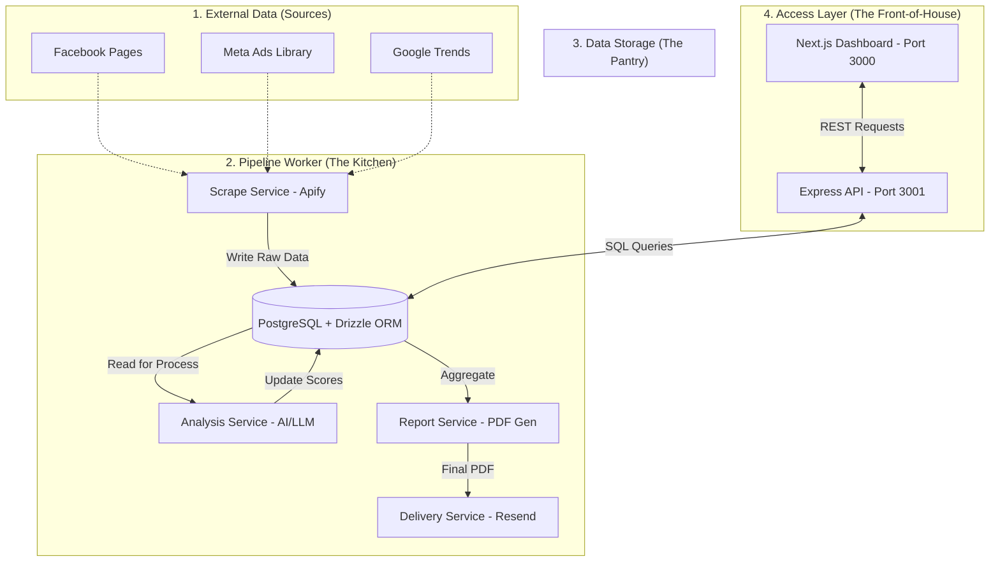

# 🏗️ Competitor Intelligence System — Backend Architecture

This document provides a high-level overview of the backend architecture, data flow, and core components of the Competitor Intelligence System.

---

## 🗺️ High-Level System Map

The system is designed as a **decoupled data pipeline**, where the data collection (Kitchen) and the user interface (Waiter) operate independently but share a common data store (Pantry).

---

## 🌊 Core Data Pipeline (The "Kitchen")

The intelligence pipeline consists of four distinct stages, ensuring data is gradually refined into actionable insights.

### 1. 📂 Scrape Stage
- **Input**: Competitor Facebook Page URLs and Meta Ads Library links.
- **Provider**: **Apify** actors browsing Facebook.
- **Output**: Raw database entries for `facebook_pages`, `facebook_posts`, and `ads`.

### 2. 🧠 Analyze Stage
- **Input**: Latest scraped data.
- **Provider**: **LLMs** (Claude/OpenAI) for semantic ad analysis.
- **Output**: assigned `health_score`, `paid_score`, `organic_score`, and marketing strategy summaries stored in `analyses`.

### 3. 📄 Generate Stage
- **Input**: Aggregated data from `analyses`, `ads`, and `trends`.
- **Process**: Data is rendered into an HTML template, then captured as a **PDF**.
- **Provider**: **Playwright/Puppeteer** with Skia-Canvas for charts.
- **Output**: PDF stored locally and a reference in the `reports` table.

### 4. ✉️ Deliver Stage
- **Input**: Generated PDF report.
- **Provider**: **Resend** Email API.
- **Output**: Automated email to configured client recipients.

---

## ⚡ The Access Layer (REST API)

The API is built using **Express.js** and serves as the bridge between the Dashboard and the database.

*   **Endpoint Prefix**: `/api`
*   **Port**: `3001`
*   **Route Highlights**:
    *   `/competitors`: CRUD for managing hotels/competitors.
    *   `/health`: Monitoring system status and market overview.
    *   `/pipeline`: Triggering manual runs (Scrape/Analyze).
    *   `/alerts`: Tracking significant competitor movements.

---

## 🛠️ The Tech Stack

| Component | Technology | Rationale |
| :--- | :--- | :--- |
| **Language** | TypeScript | Type safety and autocompletion across the stack. |
| **Framework** | Next.js (Dashboard) + Express (API) | Modern UI with a dedicated, lightweight backend. |
| **Database** | PostgreSQL | Robust, relational storage for mission-critical data. |
| **ORM** | Drizzle | Lightweight, TS-first database interaction. |
| **AI** | Anthropic Claude | High-quality reasoning for strategy and health scores. |
| **PDF** | Playwright | Reliable, pixel-perfect document rendering. |
| **Email** | Resend | High deliverability and developer-friendly API. |

---

## 🗄️ Database Schema Overview

The database uses a relational structure optimized for trend tracking and historical analysis.

| Table | Purpose | Key Fields |
| :--- | :--- | :--- |
| **`competitors`** | Core hotel directory. | `name`, `facebook_page_id`, `category`, `price_tier`. |
| **`ads`** | Historical record of Meta Ads. | `meta_ad_id`, `ad_copy`, `creative_type`, `is_active`. |
| **`analyses`** | AI-generated health scores. | `health_score`, `threat_level`, `strategy_summary`. |
| **`reports`** | PDF generation history. | `filename`, `file_path`, `recipient_count`. |
| **`facebook_pages`** | Snapshot of page metrics. | `followers`, `likes`, `rating`. |

---

## 📂 Key File Structure

- `/src/index.ts`: The CLI tool for manual pipeline management.
- `/src/api/server.ts`: Entry point for the REST API.
- `/src/db/schema.ts`: The Single Source of Truth for the data structure.
- `/src/services/`: Core logic for scraping, analysis, and reports.
- `/dashboard/`: The Next.js frontend application.
